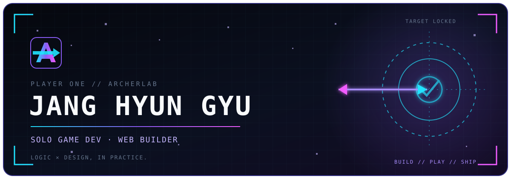

<!-- ArcherLab profile README -->

<p align="center">
  <a href="https://archerlab.dev">
    
  </a>
</p>

<div align="center">

[**ENTER ARCHERLAB**](https://archerlab.dev) &nbsp;·&nbsp; [**PLAY GAMES**](https://game.archerlab.dev) &nbsp;·&nbsp; [**CONTACT**](mailto:hyungyu@archerlab.dev)

</div>

## `> PLAYER_PROFILE`

```text
NAME       Jang Hyun Gyu
CLASS      Solo Game Developer / Web Builder
BASE       ArcherLab
PLAYSTYLE  Build small · Ship fast · Keep improving
```

## `> QUEST_LOG`

| BUILD | TYPE | PLAY |
| :--- | :--- | :---: |
| **Cupid** | Romance visual novel | [OPEN](https://cupid.archerlab.dev/) |
| **Nevergrad** | Romance visual novel | [OPEN](https://nevergrad.archerlab.dev/) |
| **School Zombie Defense** | Browser defense game | [OPEN](https://game.archerlab.dev/school-zombie-defense/) |
| **Jelly Pang!** | Merge puzzle game | [OPEN](https://game.archerlab.dev/jelly-pang-2048/) |
| **Parking Escape** | Sliding car puzzle | [OPEN](https://game.archerlab.dev/parking-escape/) |
| **Jewelria** | Match-3 puzzle | [OPEN](https://game.archerlab.dev/jewelria/) |
| **Blockpang** | Block puzzle game | [OPEN](https://game.archerlab.dev/blockpang/) |
| **Shadow Survival** | Survival action game | [OPEN](https://game.archerlab.dev/solo-leveling/) |
| **Cat Tower** | Stacking tower game | [OPEN](https://game.archerlab.dev/cat-tower/) |
| **Harem Mate** | Browser AI character chat | [OPEN](https://harem.archerlab.dev/) |

## `> LOADOUT`

```text
CORE       JavaScript · HTML · CSS
RUNTIME    Browser · Cloudflare Workers
TOOLS      GitHub · Playwright · AI-assisted workflow
FOCUS      Games · Interactive stories · Useful experiments
```

<p align="center">
  <sub><code>LOGIC × DESIGN, IN PRACTICE.</code></sub>
</p>
